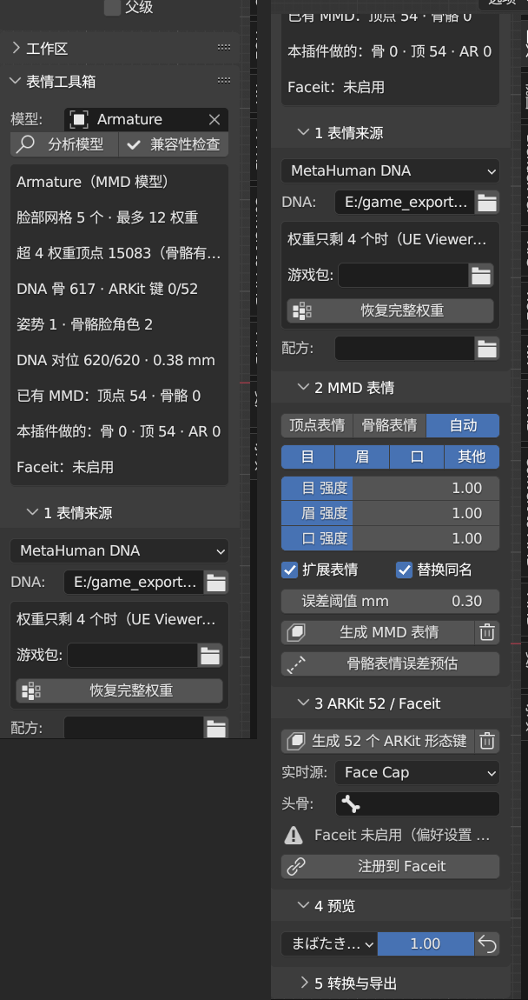

# 表情工具箱（Expression Kit）使用教程

一个 Blender 插件，给模型做三种表情：
- **MMD 骨骼表情**、**MMD 顶点表情**：导出 PMX 后 MMD 和舞蹈 VMD 按名字驱动；
- **52 个 ARKit 形态键**：注册到 Faceit，用 iPhone 实时驱动。

原理、兼容性和验证记录见插件的 [README](../scripts/blender_addons/expression_kit/README.md)；
业内还有哪些做法见 [调研报告](../reports/面部表情实现方式调研.md)。

## 1. 安装

插件已经以目录联接装进 Blender 3.6：
`%APPDATA%\Blender Foundation\Blender\3.6\scripts\addons\expression_kit` → 仓库里的 `scripts\blender_addons\expression_kit`。

1. 打开 Blender，编辑 → 偏好设置 → 插件，搜 **Expression Kit**，勾上。
2. 3D 视图按 **N**，侧栏里多一个「**表情**」页签。
3. 另外还要：
   - **mmd_tools**：做 MMD 表情和导出 PMX 用；
   - **Faceit**：只有注册到 Faceit 才需要（本机只在 3.6 里装了 Faceit）。

别的电脑：把 `expression_kit` 文件夹打成 zip，在偏好设置里「安装」。



## 2. 面板

| 部分 | 按钮 / 选项 | 做什么 |
|---|---|---|
| 顶部 | 模型 | 选骨架；空着就用当前选中的对象所在的模型 |
| | 分析模型 | 告诉你：<br>· 有几个脸部网格、每个顶点最多几个权重、权重是不是被截成了 4 个；<br>· 每种来源能不能用；<br>· 已有多少 MMD / ARKit 表情；<br>· Faceit 状态 |
| | 兼容性检查 | 列出会出问题的地方：同名的骨骼 + 顶点表情、ARKit 键会进 PMX、转换前带着形态键、表情骨骼还摆着姿势、VMD 驱动不到的表情名（超过 15 字节或不是 Shift-JIS）…… |
| 1 表情来源 | MetaHuman DNA | 选 `.dna` 文件。权重被截成 4 个时，选游戏包（`.uasset.bin`）再点「恢复完整权重」 |
| | 已有形态键 | 不用设置，自动认 ARKit 键 |
| | 姿势库 | 摆好脸部骨骼 → 填名字 → 记录；或者选一个带姿势标记的动作 |
| | 骨骼脸自动 | 不用设置，自动认眼皮、眉、下巴、嘴唇、舌头骨骼 |
| | 配方 | 可选：改过的配方 JSON（见 §5） |
| 2 MMD 表情 | 顶点表情 / 骨骼表情 / 自动 | 三选一，见 §3 |
| | 目 眉 口 其他 | 生成哪几类 |
| | 强度 | 每类一个倍数（1.0 = 原始幅度） |
| | 扩展表情 | 除了常用的，还做别名（ウィンク２右、ジト目）、单侧眉、あ２、ん、ワ …… |
| | 替换同名 | 已有同名表情时重新生成（关掉就跳过） |
| | 生成 MMD 表情 / 垃圾桶 | 生成；删除本插件做的 |
| | 骨骼表情误差预估 | 不生成，只算每个表情做成骨骼表情时 PMX 里会偏多少 |
| 3 ARKit 52 / Faceit | 生成 52 个 ARKit 形态键 / 垃圾桶 | 生成；删除本插件做的 |
| | 实时源、头骨、注册到 Faceit | 把 ARKit 键、头骨和手机 App 登记到 Faceit；面板显示手机要填的 IP 和端口 |
| 4 预览 | 表情 + 权重 | 看一个表情（骨骼表情摆姿势，形态键调数值）；↺ 全部归零 |
| 5 转换与导出 | 转换前暂存 / 转换后恢复 | Convert to MMD 转换带形态键的模型前后用 |
| | 导出 PMX | mmd_tools 导出（12.5 倍、复制贴图）；默认不带 ARKit 键 |
| | 导出配方 | 把内置配方写成 JSON，改完在「配方」里选它 |

## 3. 骨骼表情、顶点表情还是自动

| | 骨骼表情 | 顶点表情 |
|---|---|---|
| PMX 大小 | 小（Fiona 6.4 MB） | 大（Fiona 54 个表情 15 MB） |
| 中间值 | 眼皮、下巴按弧线转 | 走直线：半程时下巴约差 1 mm，眼皮不到 0.5 mm |
| 每顶点超过 4 个权重的脸 | MMD 里鼓包：Fiona 恢复完整权重后，あ２ 偏 7.8 mm | 和 Blender 里完全一样 |
| 能用的来源 | DNA、姿势库、骨骼脸 | 全部 |

- 权重本来就不超过 4 个的脸（ROE、XPS 导出的模型）：骨骼表情没有误差，用骨骼表情。
- MetaHuman 脸、恢复过完整权重的：用顶点表情，或者「自动」。
- 拿不准就先点「骨骼表情误差预估」看数字。

同一个名字只能是一种：生成骨骼表情会删掉同名的顶点表情，反过来也一样。否则 MMD 里脸会动两次。

`瞳小`（缩小瞳孔）要缩放骨骼，PMX 骨骼表情做不到，所以它只会出现在顶点表情里：
- 骨骼方式会跳过它并说明原因；
- 「自动」会选顶点表情。

目前只有 DNA 来源能做 `瞳小`（MetaHuman 有瞳孔关节）。

## 4. 四个常见例子

### 4.1 Vindictus Fiona（MetaHuman DNA）

DNA 和游戏包在 `E:\game_export\Vindictus\_meta\face\`（`SK_Fiona_Face01.dna` 和 `.uasset.bin`），
用 `scripts/vindictus/extract_face_data.py` 导出。

**做 PMX（XPS 路线）**：
1. 按手工教程 6.10，把 XPS 用 Convert to MMD 5 转好。
2. 「表情」页签：
   1. 来源选 MetaHuman DNA，选 `.dna`，游戏包选 `.uasset.bin`，点「恢复完整权重」。
      转换过的模型也能用：眼球、牙、睫毛这些拆开的网格，以及改过名的骨骼都会自动对上。
   2. MMD 表情选「顶点表情」（或「自动」），点「生成 MMD 表情」。Fiona 会做出 54 个。
   3. 想在 Blender 里用 iPhone 驱动：再点「生成 52 个 ARKit 形态键」和「注册到 Faceit」。
   4. 「转换与导出」→ 选 PMX 路径 →「导出 PMX」。默认不带 ARKit 键，要带就勾上。

**只在 Blender 里用 Faceit（不做 PMX）**：打开 `Fiona_BaseBody.blend`，依次点：
1. 恢复完整权重；
2. 生成 52 个 ARKit 形态键；
3. 注册到 Faceit。

然后在 Faceit 里：Mocap → Live → Start，手机的 Face Cap 填面板上显示的 IP 和端口。

### 4.2 自带 ARKit 形态键的模型（星刃 mod、VRoid Perfect Sync、CC4 ……）

1. 来源选「已有形态键」。
2. 「生成 MMD 表情」：从 ARKit 键混合出 MMD 表情（星刃 Fiona：49 个）。模型没有的键会列出来，例如没有 tongueOut 就做不了 ぺろっ。
3. 「注册到 Faceit」：直接注册已有的 ARKit 键。不用再点「生成 ARKit」，点了也只会提示已有。

模型还没转 MMD 的话，形态键会先做在网格上。之后用 Convert to MMD 转换前点「暂存」，转换后点「恢复」。
恢复时会顺便登记到 MMD 的表情面板。如果恢复后面板里还没有，再点一次「生成 MMD 表情」就会登记。

### 4.3 骨骼脸、没有任何表情数据（Rise of Eros 这类）

1. 先把模型转成 MMD（或导入它的 PMX）。
2. 来源选「骨骼脸自动」，点「分析模型」，看认出了几个角色（ROE：28 个）。
3. 「生成 MMD 表情」：骨骼表情 58 个，和 ROE 批量导出用的 mmd_face_morphs 做的一样。也可以选顶点表情。
4. 「生成 52 个 ARKit 形态键」（实验性）：ROE 能做 48 个，没有脸颊、鼻翼骨，做不出 cheekPuff、noseSneer。

### 4.4 自己摆表情（任意骨骼脸）

1. 进入姿势模式，摆好一个表情。
2. 来源选「姿势库」，名字填 MMD 名（例如 `まばたき`）或 ARKit 名（`eyeBlinkLeft`），点「记录」。每个表情重复一遍。
3. 「生成 MMD 表情」或「生成 52 个 ARKit 形态键」：名字和目标一样的姿势会被用上，没记录的会列出来。

已经做成动作的表情也能用，在「动作」里选它：
- 有姿势标记：每个标记是一个表情，名字用标记名；
- 没有标记：整个动作的第一帧算一个表情，名字用动作名。

游戏的「无表情」不是绑定姿势时，在「中性」里填它的名字。

## 5. 改配方

配方就是「每个表情由什么组成」，例如 MMD 的 `笑い`：

```json
{"name": "笑い", "name_e": "smile", "category": "EYE",
 "arkit": {"eyeBlinkLeft": 0.8, "eyeBlinkRight": 0.8, "eyeSquintLeft": 0.5, "eyeSquintRight": 0.5,
           "cheekSquintLeft": 0.5, "cheekSquintRight": 0.5},
 "metahuman": {"eyeBlinkL": 0.85, "eyeBlinkR": 0.85, "eyeSquintInnerL": 0.5, "eyeSquintInnerR": 0.5,
               "eyeCheekRaiseL": 0.6, "eyeCheekRaiseR": 0.6},
 "roles": [["upper_lid_L", "pitch", 11.55], ...]}
```

- `arkit`：已有形态键来源用。名字前加 `?` 表示可选（例如星刃的 `?TeethLowerDown`）。
- `metahuman`：DNA 来源用，写 DNA 的原始控制量名。
- `roles`：骨骼脸来源用，写 `(角色, pitch/roll/yaw/move, 量)`，含义见插件 README §3.4。
- `names`：姿势库来源用，写 `{"姿势名": 权重}`。

步骤：
1. 「转换与导出」→「导出配方」→ MMD 或 ARKit，得到一个 JSON。
2. 改里面的数，或者加新表情（新的名字、分类）。
3. 在「1 表情来源」的「配方」里选这个文件，再生成。文件里的表情会覆盖内置的同名表情，新名字会加到后面。

## 6. 常见问题

| 现象 | 原因 / 办法 |
|---|---|
| 「只有 N 个 DNA 关节是骨骼」 | 选错了 DNA，或者不是 MetaHuman 脸 |
| 表情鼓包、脸颊一块块 | 权重被 UE Viewer 截成了 4 个：先「恢复完整权重」，再重新生成 |
| 骨骼表情在 Blender 里好好的，MMD 里鼓包 | PMX 只存 4 个权重：换顶点表情或「自动」；「骨骼表情误差预估」能看到偏多少 |
| 导出的 PMX 多了 52 个英文表情 | 勾了「带 ARKit 形态键」；不勾就不带 |
| Convert to MMD 转换后手臂没对齐 | 带着形态键转换了：撤销，「暂存」后再转，转完「恢复」 |
| MMD 里脸动两次 | 同名的骨骼表情和顶点表情都在：点「兼容性检查」，重新生成一次（替换同名开着） |
| 导出后眨眼变成眼皮外翻 | 导出时表情骨骼还摆着姿势：点预览里的 ↺ 归零（「导出 PMX」按钮会自动归零） |
| Faceit 注册失败 | Faceit 没装或没启用：偏好设置 → 插件 → Faceit |
| ウィンク 闭的眼和某个下载的模型相反 | 插件按日本原生模型的约定：ウィンク 闭模型自己的左眼。下载的「18」系列转换模型是镜像的，见插件 README §3.1b |
