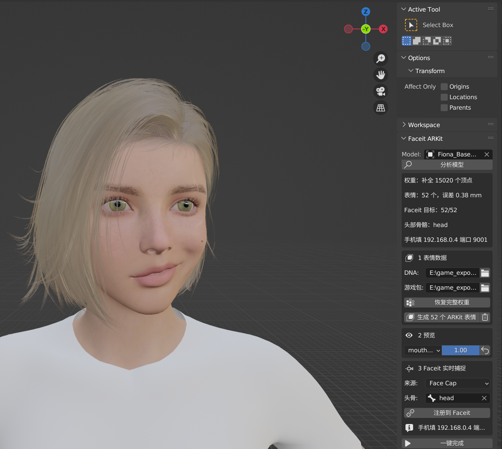

# 用 iPhone Face Cap 通过 Faceit 控制模型表情 —— Faceit ARKit 插件使用指南

**目标**：手机上的 Face Cap 捕捉你的脸，Blender 里的 Faceit 实时接收，模型跟着做表情。

Faceit 实时捕捉驱动的是模型上 **52 个 ARKit 形态键**（eyeBlinkLeft、jawOpen ……）。游戏里导出的模型通常没有这些形态键，
「Faceit ARKit」插件就是把它们补上并接进 Faceit 的。原理见插件目录的
[README](../scripts/blender_addons/faceit_arkit/README.md)；表情数据来自这张脸的 `.dna` 文件，
它是什么、里面有什么、怎么算出表情，见 [MetaHuman DNA 说明](metahuman-dna.md)。



*（截图里面板临时放在 Tool 页签；装好后它在侧栏的 **ARKit** 页签。模型在预览 mouthSmileLeft = 1。）*

第一个做好的例子：`E:\game_export\Vindictus\Fiona\blend\Fiona_BaseBody\Fiona_BaseBody_faceit.blend`。

---

## 1. 准备

1. **Blender 3.6**：本机的 Faceit（2.3.40）只装在 3.6 里。
2. **启用两个插件**：编辑 → 偏好设置 → 插件，搜索并勾选
   - **FACEIT**
   - **Faceit ARKit**（已用目录联接装好：`%APPDATA%\Blender Foundation\Blender\3.6\scripts\addons\faceit_arkit`
     指向仓库里的 `scripts\blender_addons\faceit_arkit`；在别的电脑上可以把这个目录打成 zip，用「安装」装进去）。
3. **这张脸的数据**（MetaHuman 模型才需要）：
   - Vindictus 的 Fiona 已经提取好了：`E:\game_export\Vindictus\_meta\face\SK_Fiona_Face01.dna`（表情）和
     `SK_Fiona_Face01.uasset.bin`（原始网格包，用来恢复完整权重）。重新提取：
     `python scripts\vindictus\extract_face_data.py --face Fiona`。
   - 其他 MetaHuman：用 MetaHuman 自带的 `.dna` 文件（MetaHuman Creator / Bridge 导出的源文件里有）。

## 2. 在面板上操作

打开模型的 .blend，在 3D 视图按 **N** 打开侧栏，切到 **ARKit** 页签。

1. **Model**：选模型的骨架（空着就用当前选中的物体所属的模型）。
2. **分析模型**：看一下报告——
   - 脸部网格几个、面部骨骼几根、每顶点最多几个权重；
   - 如果出现「**! 权重被截成 4 个，先恢复**」：说明是 UE Viewer 导出的，必须先恢复权重，否则表情会起包；
   - 选了 DNA 后还会显示「DNA 关节 620/620、误差 0.38 mm」这类对位结果；
   - ARKit 表情现有几个、Faceit 是否启用/已注册、自动找到的头部骨骼。
3. **1 表情数据**：
   - **DNA**：选 `.dna` 文件；
   - **游戏包**：选 `.uasset.bin`。可以空着——和 DNA 同名放在一起的会被自动找到；
   - **恢复完整权重**：从游戏包里把完整的骨骼权重写回（只改 UE Viewer 截断过的顶点，手工改过的区域不动）；
   - **生成 52 个 ARKit 表情**：由 DNA 算出 52 个表情，存成形态键（同名的会重建；右边的垃圾桶只删本插件生成的）。
4. **2 预览**：选一个表情、拖数值看效果；旁边的按钮把表情全部归零。
5. **3 Faceit 实时捕捉**：
   - **来源**：Face Cap（也可选 Live Link Face、iFacialMocap、Hallway Tile）；
   - **头骨**：手机转头时转动哪根骨骼，通常自动找对（Fiona 是 `head`）；
   - **注册到 Faceit**：登记脸部网格、52 个目标形态键、头部骨骼、实时源；下面会显示**手机要填的 IP 和端口**。
6. **一键完成** = 恢复权重（有游戏包时）+ 生成表情 + 注册 Faceit。
7. **保存文件**（Ctrl+S）。

## 3. 连接 iPhone 的 Face Cap

1. 电脑和手机连**同一个 Wi‑Fi**。
2. Blender：侧栏 **FACEIT** 页签 → **Mocap** → **Live Recorder**：来源 Face Cap、端口 9001（已设好）→ 点 **Start Receiver**。
3. 第一次接收时 Windows 防火墙会弹窗，勾「专用网络」→ 允许。之前拒绝过的话，要在防火墙里放行 `blender.exe` 的 UDP 9001。
4. 手机：Face Cap 打开实时（Live）模式的 OSC 发送，**IP 填面板上显示的地址**（本机 192.168.0.4）、端口 **9001**，开始发送。
5. 模型的脸应该马上跟着动；头部跟着手机里你的头转。
6. **录下来**：接收期间 Faceit 在记录；点 **Stop Receiver** 停止，再点 **Import OSC Recording** 存成动画（Action）。
7. 常用调整：
   - **Mirror X**（Live Recorder 里）：想要照镜子的效果（你眨左眼，屏幕左边那只眼眨）就勾上；
   - 某个表情嫌弱/嫌强：**Shapes** 页里调那一项的 **Amplify**；
   - 不想转头：Live Recorder 里关掉头部旋转。

## 4. 适配别的模型

| 情况 | 怎么做 |
|---|---|
| **Fiona 的其他模型**（`E:\game_export\Vindictus\Fiona\blend\<名字>\<名字>.blend`，15 套服装 + 裸模） | 同一张脸，用同一份 DNA 和游戏包，直接「一键完成」。已试过默认铠甲 `Fiona.blend`：32481 个顶点全部配上 |
| **别的 MetaHuman** | 选它自己的 `.dna`。从 MetaHuman 官方渠道导出的网格权重本来就是完整的，不需要游戏包 |
| **已经有 ARKit 形态键的模型**（名字写法不限：eyeBlinkLeft / eyeBlink_L / Eye_Blink_L …） | 不用 DNA，直接「注册到 Faceit」。例：剑星 Eve 有 49 个（缺 noseSneer 左右和 tongueOut，模型里本来就没有） |
| **两样都没有**（例：Vindictus 的 Lethita，不是 MetaHuman） | 这个插件做不了，用 Faceit 自己的流程：Setup 注册 → 标定特征点 → Rig → Expressions 生成 ARKit 表情 → Bake |

查 Vindictus 里哪些脸带 DNA：`python scripts\vindictus\extract_face_data.py --list`（目前只有 Fiona）。

### 批量（命令行）

面板的每个按钮都有同名函数（`faceit_arkit.api`），命令行和面板结果一样。例：给 Fiona 的每个模型各做一份 `_faceit.blend`，已经有的跳过（PowerShell）：

```powershell
$blender = 'D:\Program Files\blender-3.6.15-windows-x64\blender.exe'
$cli = 'E:\code\othercode\ripper_tpose\scripts\blender_addons\faceit_arkit\cli.py'
$dna = 'E:\game_export\Vindictus\_meta\face\SK_Fiona_Face01.dna'
Get-ChildItem 'E:\game_export\Vindictus\Fiona\blend' -Directory | ForEach-Object {
    $src = Join-Path $_.FullName ($_.Name + '.blend')
    $out = Join-Path $_.FullName ($_.Name + '_faceit.blend')
    if ((Test-Path $src) -and -not (Test-Path $out)) {
        & $blender -b --factory-startup $src --python $cli -- --dna $dna --out $out
    }
}
```

参数：`--package`（不给就找 DNA 旁边同名的 `.uasset.bin`）、`--no-weights`、`--no-faceit`、`--head <骨骼>`、
`--source FACECAP|EPIC|IFACIALMOCAP|TILE`、`--no-backup`（覆盖已有文件时不留 .blend1）。

## 5. 常见问题

- **表情一动脸上起包**：权重被 UE Viewer 截成 4 个了。「分析模型」会提示，先「恢复完整权重」再生成表情。
- **分析显示 DNA 关节 0/620**：模型的骨骼名字和 DNA 对不上。要用游戏导出的原始 .blend，不要用 XPS 转一圈回来的
  （XPS 导出会把 `FACIAL_L_Eye` 之类改名）。
- **注册时报「Faceit 未启用」**：偏好设置里启用 FACEIT。
- **手机连不上**：同一个 Wi‑Fi、IP 和端口一致、防火墙放行；Blender 里要先点 Start Receiver。
- **左右反了**：勾 Mirror X。
- **吐舌头时舌头穿过嘴唇**：tongueOut 单独用时嘴是闭着的；实际捕捉时手机会同时给出张嘴，一般没问题。
- **转成 XPS 后表情没了**：XPS 格式不存形态键。要带表情去 MMD，在 PMX 这一步加（见 `scripts/vindictus/export_pmx.py`）。

## 6. 已知限制

- 形态键是线性叠加的：MetaHuman 的组合修正（PSD，如「笑 + 张嘴」同时出现时的额外修正）没有。所有 ARKit 形态键方案都一样。
- 眼珠转动存成形态键是直线插值，中间角度会有零点几毫米的误差，看不出来。
- 恢复权重只认 **UE5 烘焙包**（zen 格式、可变权重数）。UE4 的游戏（FF7、剑星）暂不支持。
- 头部转动只转一根骨骼（Faceit 的做法），脖子不跟着分担。
