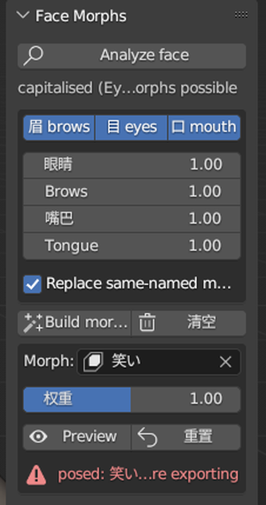
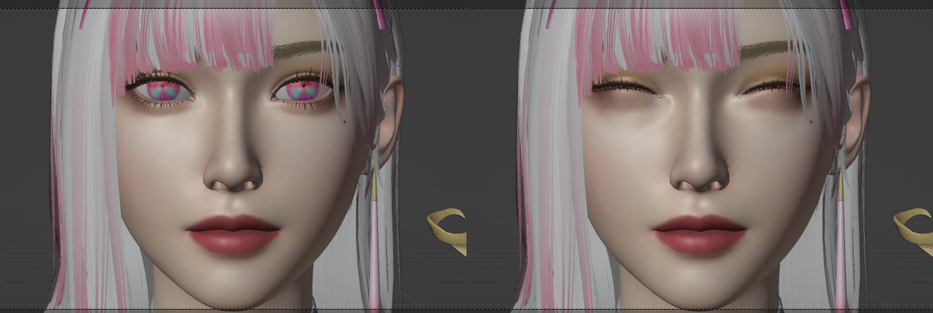

# 在 Blender 里给 MMD 模型加表情（mmd_face_morphs 操作指南）

2026-09-19。ROE 的角色脸上没有 shape key，表情靠骨骼；`scripts/blender_addons/mmd_face_morphs`
把 MMD 标准表情集做成 PMX 骨骼 morph。这篇讲**怎么用**，原理和参数见插件目录里的
[README](../scripts/blender_addons/mmd_face_morphs/README.md)。

## 0. 现在是插件还是命令行？

两种都有，同一套代码：

| 方式 | 什么时候用 | 入口 |
|---|---|---|
| **Blender 插件面板** | 手动给一个模型加/重建/微调表情，想立刻看到 | 3D 视图侧栏（N）→ **MMD** 页签 → **Face Morphs** |
| **命令行 / 脚本** | 批量（ROE 导出流程 `export_character_models.ps1` 自动调）、渲对照图核对 | `api.setup()`、`tools/render_morph_sheet.py` |

想自己动手，走插件面板；批处理已经在导出时自动做了（只有 2026-09-19 之后重导的模型才带
新表情，老 PMX 还是 9 个）。

## 1. 准备

- Blender 3.6，mmd_tools 已启用。
- 本插件：本机是目录联接（`%APPDATA%\Blender Foundation\Blender\3.6\scripts\addons\mmd_face_morphs`
  → 仓库目录），Preferences → Add-ons 里勾上 **MMD Face Morphs**。换机器：把
  `scripts/blender_addons/mmd_face_morphs` 打 zip 用 Install 装，或者同样做一个联接。
- 一个 mmd_tools 结构的模型：**File → Import → MikuMikuDance Model (.pmd, .pmx)**，导入选项里
  把 **Morphs** 勾上（默认勾着），Physics 可以不勾（脸的事用不上，导入更快）。

## 2. 给模型加表情（最常见的一条路）



1. 点选模型的任意一部分（骨架或网格都行），按 **N** 打开侧栏，切到 **MMD** 页签，找到
   **Face Morphs** 面板（在 mmd_tools 自己的面板下面）。
2. **Analyze face**：面板第一行会报「认出的拼法 | 找到几根脸骨 | 58 个表情里能建几个」。
   控制台（Window → Toggle System Console）里有每个 role 对应的骨名。
   如果报 `NO eye/lid/brow pair: nothing will build`，说明这张脸没有成对的眼睛/眼皮/眉毛骨，
   量不出尺寸，插件不会瞎建——ROE 的男模就是这样。
3. 勾要建的类别（**眉 brows / 目 eyes / 口 mouth**），四个倍率先留 1.0（那是标定值，
   眨眼闭合 33°、あ 张 18°）。**Replace same-named morphs** 保持勾选：模型里已有的同名
   morph（比如老流程那 9 个）会被重建。
4. **Build morphs**。面板底部报「N morphs: 眉 x, 目 y, 口 z; skipped w」。它同时把全部 morph
   登记进 `表情` 显示枠——MMD 的表情面板读的是这个枠。
5. 看效果：**Morph** 下拉选一个（比如 笑い），拖 **权重**，按 **Preview**，脸就摆出来；
   **重置（Reset）** 复位。



6. **导出前一定按 Reset**。摆着姿势时面板会有一行红字 `posed: 笑い - Reset before exporting`。
   原因：模型点过物理 Build 之后，mmd_tools 的导出器会把当前站着的姿势从每个 morph 的偏移里
   减掉，忘了复位的话眨眼会导出成下眼皮往下翻。Build morphs 自己也会先复位一次。
7. **File → Export → MikuMikuDance Model**，和平时一样。

想撤掉：**清空（Clear）** 只删本插件在这个模型上建过的（记录在模型根对象的
`mmd_face_morphs` 属性里）；没有记录就什么都不删，所以不会误伤别人手做的 まばたき。

## 3. 微调某一个表情

- **只是幅度不对**：调面板上的倍率（Eyes / Brows / Mouth / Tongue），再 Build 一次即可，
  同名的会被替换。倍率是乘在整个类别上的。
- **想精调某一个**：用 mmd_tools 自带的 **Morph Tools** 面板（同在 MMD 页签）：
  1. Morph 类型切到 **Bone**，列表里选中要改的（比如 怒り）。
  2. 点 **View**，骨骼摆成这个 morph 的样子。
  3. 进 **Pose Mode**，改眉骨/嘴骨的位置或旋转。
  4. 回到 Object Mode，点 **Apply**，当前姿势写回这个 morph；再 **Clear** 复位。
  这样改过的 morph 下次按 Build（Replace 勾着）会被配方重建覆盖——想保留就把 Replace
  取消勾选，或者只对别的类别 Build。

## 4. 自己加一个新表情

**不写代码（单个模型）**：Morph Tools → Bone 列表 **+** 新建一条，改名（要和 VMD 里的
名字一字不差，比如 `にやり３`），设分类（眉/目/口），Pose Mode 摆好骨，**Apply**。
然后到 mmd_tools 的 **Display Panel** 面板 → **Quick Setup → Load Facial Items**，让它进
`表情` 枠。

**写配方（所有模型都有）**：在 `scripts/blender_addons/mmd_face_morphs/expressions.py` 的
`MORPHS`（或 `EXTRAS`）列表里加一行，然后 Blender 里 **F3 → Reload Scripts**（插件入口会
连子模块一起重载），再 Build。一条动作是 `(role, kind, amount)`：

| kind | 意思 | 正方向 |
|---|---|---|
| `pitch` 度 | 绕左右轴转 | 骨的前端向下（眼皮闭、下巴张） |
| `roll` 度 | 绕前后轴转 | 外侧端向上，左右自动镜像 |
| `yaw` 度 | 绕上下轴转 | 前端向外摆 |
| `move` (out, fwd, up) | 位移，单位是**眼距** | out 离开中线（左右镜像）、fwd 朝前 |

例子，单侧的嘴角上扬：

```python
morph("口角上げ左", "corner_up_left", "MOUTH", corners(up=0.08, sides="L")),
```

用得上的 role：`upper_lid_L/R`、`lower_lid_L/R`、`brow_L/R`（整根）、`brow_L_inner/centre/outer`
（分段）、`chin`、`corner_L/R`、`upper_lip_C/L/R`、`lower_lip_C/L/R`、`tongue_0/1/2`、
`teeth_up/dw`。模型缺的 role 会被跳过，不报错。幅度是渲出来看的，别猜：改完用第 6 节的
对照图跑一遍。

## 5. 看它在动作里动不动

Preview 只是摆骨。要看 VMD 驱动：
1. Morph Tools 面板点 **Bind**（mmd_tools 会给每个 morph 建一个滑块）。
2. **File → Import → MikuMikuDance Motion (.vmd)**，选一个带口型的动作，
   `E:\Downloads\mmd\客官不可以2026.6.16by小王动画\` 里那几个有 1500 多个口型键。
3. 空格播放。绑定期间 Face Morphs 的 Preview 不起作用（骨被滑块驱动着），要用就先 **Unbind**。

现成的场景：`D:\roe_exports\b14\blend\pmx\pc_b14_outfit1_hd_facelab.blend`，打开就是上面
这一套（相机挂在头骨上跟拍），按空格看。开着 blender-mcp 的话
`python scripts\blender_mcp\mcp_exec.py scripts\blender_mcp\face_demo.py` 会在你打开的
Blender 里现场做一遍，`face_demo_stop.py` 停。

## 6. 命令行方式

```powershell
# 逐个表情渲一张正脸特写，贴标签拼图（--hide hair 把刘海遮掉看眉毛）
blender --background --python scripts\blender_addons\mmd_face_morphs\tools\render_morph_sheet.py -- `
    model.pmx out_dir --setup [--only "怒り,困る"] [--hide hair]
python scripts\blender_addons\mmd_face_morphs\tools\make_sheet.py out_dir sheet.png --cols 7

# 批处理：ROE 导出流程已经内置，重导一个模型
.\scripts\riseoferos\export_character_models.ps1 -Only b14_outfit1 -Format pmx -Force
```

脚本里调：

```python
import sys; sys.path.insert(0, r"E:\code\othercode\ripper_tpose\scripts\blender_addons")
from mmd_face_morphs import api
report = api.setup(root_object, scales={"mouth": 1.2}, log=print)   # report["morphs"] / ["skipped"]
```

## 7. 容易踩的坑

- 导出前没 Reset → morph 全歪（见第 2 节第 6 步）。
- Morph slider 绑着时 Preview 没反应 → Unbind。
- 半角/全角名字：VMD 按字节匹配，`ｳｨﾝｸ２右` 和 `ウィンク２右` 是两个 morph，插件两个都建了。
- 舌头穿下巴、嘴角拉成一条线：都是幅度问题，倍率往下调，或改配方后渲对照图看。
- 男模（a03–a06）0 个表情是对的，没脸骨。
